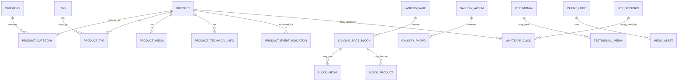

# 02 — Modelo de Domínio

## 1. Objetivo do documento

Este documento define o modelo de domínio do novo site da AlugaGames.

O objetivo é descrever as principais entidades, conceitos, relações e regras do sistema antes da modelagem física do banco de dados e antes da implementação das features.

Este documento não é o schema final do banco. O schema será definido em `03-banco-de-dados.md`. Aqui o foco é responder:

- Quais conceitos existem no sistema.
- Como eles se relacionam.
- Quais regras cada entidade precisa respeitar.
- Quais partes pertencem ao site público, ao portal admin e aos fluxos de WhatsApp.

---

## 2. Visão geral do domínio

O sistema da AlugaGames será composto por três grandes áreas de domínio:

1. **Catálogo**  
   Responsável por produtos, categorias, tags, filtros, imagens, vídeos e páginas individuais de produto.

2. **CMS controlado do site**  
   Responsável pelos blocos editáveis da landing page, depoimentos, FAQs, logos/clientes e configurações visuais principais.

3. **Conversão para WhatsApp**  
   Responsável por montar mensagens, registrar cliques e permitir que o visitante envie interesse por um produto individual ou por uma lista simples de produtos.

Além dessas áreas, existem domínios auxiliares:

- **Fotografia/Galeria**, para álbuns de eventos realizados.
- **Admin**, para acesso do dono do sistema via Clerk.
- **Mídias**, para imagens usadas em produtos, LP, galeria, logos e conteúdos visuais.
- **Configurações do site**, para WhatsApp, redes sociais, contatos e informações gerais.

---

## 3. Diagrama conceitual



---

## 4. Agregados principais

## 4.1 Product

Produto é o principal elemento comercial do site.

No novo sistema, tudo que o visitante pode conhecer e solicitar pelo WhatsApp será tratado como produto, mesmo que na prática seja brinquedo, game, atração, equipamento, experiência ou pacote.

Exemplos:

- Simulador de corrida.
- Touro mecânico.
- Realidade virtual.
- Inflável.
- Decoração temática.
- Máquina de algodão doce.
- Atração para evento corporativo.

### Responsabilidades

O produto deve permitir:

- Ser exibido na página `/produtos`.
- Ser encontrado por busca, categoria, tag e filtros.
- Ter página individual com informações completas.
- Ser adicionado à lista simples de produtos.
- Gerar mensagem de WhatsApp individual.
- Ser marcado como destaque para aparecer na LP.
- Ser ativado, desativado ou marcado como indisponível.

### Campos conceituais

- Nome.
- Slug.
- Descrição curta.
- Descrição completa.
- Status.
- Categorias.
- Tags.
- Indicações de evento.
- Imagens.
- Vídeos por URL externa.
- Informações técnicas.
- Produto em destaque.
- SEO title.
- SEO description.
- Data de criação.
- Data de atualização.

### Status possíveis

```txt
active        -> aparece normalmente no site público
inactive      -> não aparece no site público
unavailable   -> aparece, mas marcado como indisponível
```

### Regras

- Produto precisa ter nome.
- Produto precisa ter slug único.
- Produto precisa ter pelo menos uma categoria ativa para ser bem filtrado.
- Produto pode ter múltiplas categorias.
- Produto pode ter múltiplas tags.
- Produto pode ter múltiplas imagens.
- Produto pode ter vídeos externos, mas o sistema não precisa armazenar vídeo no MVP/produto inicial.
- Produto não deve exibir preço público.
- Produto ativo pode aparecer na página `/produtos`.
- Produto inativo não deve aparecer no site público.
- Produto indisponível pode aparecer, mas não deve ser incentivado como primeira opção.
- Produto pode ser marcado como destaque para aparecer na landing page.
- Produto pode ter informações técnicas opcionais.
- Produto pode ter SEO próprio.

---

## 4.2 Category

Categoria é uma forma de organizar produtos para navegação, filtros e gestão interna.

Mesmo que o site não tenha páginas separadas como “infláveis”, “lista de jogos” ou “máquinas”, as categorias continuam existindo para filtro, organização e SEO.

### Exemplos

- Games.
- Infláveis.
- Realidade virtual.
- Máquinas.
- Decoração.
- Eventos corporativos.
- Festa infantil.
- Aniversário.

### Responsabilidades

A categoria deve permitir:

- Filtrar produtos na página `/produtos`.
- Organizar produtos no admin.
- Ajudar o visitante a encontrar atrações relacionadas.
- Permitir que um produto pertença a mais de um agrupamento.

### Campos conceituais

- Nome.
- Slug.
- Descrição opcional.
- Status ativo/inativo.
- SEO title opcional.
- SEO description opcional.

### Regras

- Categoria precisa ter nome.
- Categoria precisa ter slug único.
- Categoria pode ser ativada ou desativada.
- Categoria desativada não deve aparecer como filtro público.
- Produtos associados a uma categoria desativada podem continuar existindo.
- A ordenação pública das categorias pode ser alfabética.

---

## 4.3 Tag

Tag é uma classificação flexível para melhorar pesquisa e filtros.

Diferente de categoria, tag é mais livre e pode representar público, ocasião, tipo de uso ou característica.

### Exemplos

- Infantil.
- Adulto.
- Corporativo.
- Escolar.
- Condomínio.
- Festa.
- Premium.
- Mais procurado.
- Realidade virtual.
- Decoração.

### Responsabilidades

A tag deve permitir:

- Melhorar filtros.
- Ajudar na busca.
- Agrupar produtos por intenção de uso.
- Dar flexibilidade ao admin sem criar categorias demais.

### Campos conceituais

- Nome.
- Slug.
- Status ativo/inativo.

### Regras

- Tag precisa ter nome.
- Tag precisa ter slug único.
- Tag pode ser criada, editada e desativada pelo admin.
- Um produto pode ter várias tags.
- Uma tag pode estar em vários produtos.

---

## 4.4 ProductMedia

Representa imagens e vídeos associados a um produto.

### Tipos

```txt
image        -> imagem armazenada no storage
video_url    -> URL externa de vídeo, como YouTube, Vimeo ou link equivalente
```

### Campos conceituais

- Produto relacionado.
- Tipo de mídia.
- URL.
- Texto alternativo.
- Ordem de exibição.
- Indicação de capa.
- Status ativo/inativo.

### Regras

- Produto pode ter várias mídias.
- Apenas uma imagem deve ser marcada como capa principal.
- Imagens devem ter alt text editável.
- Vídeos devem ser salvos como URL externa.
- Arquivos de vídeo não devem ser enviados para o storage do sistema nesta fase.
- Mídias inativas não aparecem no site público.

---

## 4.5 ProductTechnicalInfo

Representa informações técnicas opcionais exibidas na página individual de produto.

### Exemplos de informações

- Idade recomendada.
- Tipo de evento indicado.
- Ambiente interno/externo.
- Energia necessária.
- Se inclui monitor.
- Observações de montagem.
- Duração recomendada.

### Regras

- Informações técnicas são opcionais.
- Cada produto pode ter várias informações técnicas.
- O admin deve conseguir editar essas informações.
- Informações vazias não devem aparecer no site público.
- Não haverá filtro por espaço necessário.
- Não haverá filtro por número de jogadores.

---

## 4.6 EventIndication

Representa para quais tipos de evento um produto é indicado.

### Exemplos

- Evento corporativo.
- Festa infantil.
- Escola.
- Condomínio.
- Aniversário.
- Feira.
- Confraternização.

### Responsabilidades

- Permitir filtro na página de produtos.
- Ajudar o visitante que ainda não sabe exatamente qual produto deseja.
- Permitir comunicação mais consultiva e menos e-commerce.

### Regras

- Um produto pode ter várias indicações de evento.
- Uma indicação pode estar presente em vários produtos.
- Indicações devem poder ser editadas pelo admin, diretamente ou via tags/categorias, conforme a implementação decidir.

---

# 5. Lista simples de produtos

A lista simples de produtos é uma funcionalidade de apoio à conversão por WhatsApp.

Ela pode ser visualmente parecida com um carrinho, mas conceitualmente não é um carrinho de compra.

## Nome recomendado na interface

Usar termos como:

- Lista de produtos.
- Minha seleção.
- Produtos selecionados.

Evitar termos que comuniquem compra fechada, como:

- Checkout.
- Pagamento.
- Pedido.
- Finalizar compra.

## Responsabilidades

A lista deve permitir:

- Adicionar produto.
- Remover produto.
- Alterar quantidade.
- Ver os produtos selecionados.
- Enviar a lista para o WhatsApp com mensagem pronta.

## Armazenamento

- A lista deve ser mantida no navegador do visitante, usando estado client-side e/ou localStorage.
- A lista não precisa criar pedido no banco.
- A lista não exige login de cliente.
- A lista não armazena dados pessoais.

## Regras

- O fluxo principal valorizado continua sendo: produto individual → WhatsApp.
- A lista é apenas uma alternativa para visitantes que querem selecionar vários produtos antes de chamar.
- A mensagem enviada ao WhatsApp deve conter os produtos e quantidades.
- Produto indisponível não deve ser incentivado na lista.
- Produto inativo não deve poder ser adicionado.

## Exemplo de mensagem

```txt
Olá, vim pelo site da AlugaGames e tenho interesse nestes produtos:

- Simulador de Corrida x1
- Realidade Virtual x2
- Air Hockey x1

Pode me passar mais informações?
```

---

# 6. WhatsApp

WhatsApp é o canal principal de conversão do sistema.

## Tipos de clique

O sistema pode gerar diferentes mensagens de acordo com a origem:

```txt
general_cta       -> CTA geral da LP ou header
product_cta       -> CTA de produto individual
product_list_cta  -> CTA da lista de produtos
photography_cta   -> CTA relacionado à galeria/fotografia, se existir
work_with_us_cta  -> CTA do footer “Trabalhe conosco”
representative_cta -> CTA de representante, se necessário
```

## Regras

- O número do WhatsApp deve ser configurável pelo admin.
- O site deve usar apenas um número principal.
- A mensagem deve mudar de acordo com a origem do clique.
- Cliques podem ser registrados para estatísticas simples.
- O registro de clique não deve bloquear o redirecionamento para o WhatsApp.
- O visitante não precisa preencher formulário antes de abrir o WhatsApp.

---

# 7. Landing Page

A landing page é a página principal do site público.

Ela deve ter aparência premium/profissional, focada em empresas planejando eventos, mas sem perder o aspecto divertido e visual do segmento de atrações e games.

## Modelo de edição

A LP será gerenciada por um CMS controlado por blocos.

Isso significa que o admin não poderá criar qualquer layout livre do zero como em um page builder completo. Em vez disso, o sistema terá blocos previamente definidos, editáveis e, quando possível, ordenáveis/ativáveis.

## Blocos previstos

- Hero principal.
- Galeria/banner de imagens principais.
- Logos de empresas/clientes.
- Por que escolher a AlugaGames.
- Produtos ou atrações em destaque.
- Como funciona.
- Blocos de soluções/tipos de produto.
- Depoimentos.
- FAQ.
- CTA final.

## LandingPageBlock

Representa um bloco editável da LP.

### Campos conceituais

- Tipo do bloco.
- Título.
- Subtítulo.
- Texto.
- Imagens.
- Produtos relacionados, quando aplicável.
- Botão/CTA, quando aplicável.
- Ordem.
- Status ativo/inativo.
- Configurações específicas do bloco.

### Regras

- Blocos inativos não aparecem no site público.
- Nem todo bloco precisa ter todos os campos.
- Alguns blocos podem relacionar produtos específicos, como “Produtos mais procurados”.
- Alguns blocos podem usar imagens, como hero e galeria.
- Alguns blocos podem usar conteúdo estruturado, como FAQ e depoimentos.
- O admin deve conseguir editar o conteúdo principal dos blocos.
- A edição deve ser limitada para preservar o design e evitar quebra visual.

---

# 8. Fotografia e galeria

A página de fotografia existe para mostrar registros dos produtos e eventos da AlugaGames.

Ela não é um serviço separado e não tem objetivo principal de vender fotografia. Sua função é gerar prova visual, demonstrar qualidade e ajudar o visitante a imaginar os produtos em eventos reais.

## GalleryAlbum

Álbum representa um evento ou conjunto de fotos.

### Campos conceituais

- Nome do evento.
- Tipo de evento.
- Data opcional.
- Cidade opcional.
- Fotos.
- Status ativo/inativo.
- Data de criação.
- Data de atualização.

### Regras

- O admin pode criar, editar e remover/desativar álbuns.
- O visitante pode pesquisar ou filtrar álbuns por tipo de evento.
- Álbum inativo não aparece no site público.
- A página pública deve mostrar fotos de forma visual e organizada.

## GalleryPhoto

Foto pertencente a um álbum.

### Campos conceituais

- Álbum relacionado.
- URL da imagem.
- Alt text opcional.
- Ordem de exibição.
- Status ativo/inativo.

### Regras

- Foto pertence a um álbum.
- Fotos podem ser adicionadas e removidas pelo admin.
- Foto inativa não aparece no site público.
- Não é obrigatório ter título ou descrição pública para cada foto.

---

# 9. Depoimentos

Depoimentos são usados na landing page como prova social.

## Campos conceituais

- Nome da pessoa ou empresa.
- Cargo ou descrição opcional.
- Texto do depoimento.
- Imagem opcional.
- Status ativo/inativo.
- Destaque opcional.

## Regras

- Depoimentos devem ser editáveis pelo admin.
- Apenas depoimentos ativos aparecem no site público.
- O sistema pode permitir escolher depoimentos em destaque.
- Depoimentos vazios ou incompletos não devem ser exibidos.

---

# 10. FAQ

FAQ representa perguntas frequentes exibidas na LP ou em áreas de apoio à conversão.

## Campos conceituais

- Pergunta.
- Resposta.
- Ordem.
- Status ativo/inativo.

## Regras

- FAQ deve ser editável pelo admin.
- FAQ ativo pode aparecer na LP.
- FAQ inativo não aparece no site público.
- A ordenação pode ser manual ou por data, conforme implementação.

---

# 11. Logos e clientes

Logos de clientes/empresas são usados como prova social na landing page.

## Campos conceituais

- Nome do cliente/empresa.
- Logo.
- URL opcional.
- Status ativo/inativo.
- Ordem opcional.

## Regras

- Logos devem ser gerenciáveis pelo admin.
- Apenas logos ativos aparecem no site público.
- Logos devem ter alt text ou nome acessível.

---

# 12. Páginas institucionais

## 12.1 Representante AlugaGames

Página institucional estática baseada na página atual.

### Regras

- Conteúdo não precisa ser editável pelo admin inicialmente.
- Deve receber novo design visual alinhado ao site.
- Pode ter CTA para WhatsApp se necessário.

## 12.2 Por que contratar

Página institucional estática baseada na página atual.

### Regras

- Conteúdo não precisa ser editável pelo admin inicialmente.
- Deve comunicar diferenciais da AlugaGames.
- Deve ter design mais premium/profissional.

## 12.3 Trabalhe conosco

Não será uma página própria no produto inicial.

### Regras

- Deve existir apenas como link no footer.
- O clique deve abrir WhatsApp com mensagem estática.
- Não haverá formulário de candidatura.
- Não haverá upload de currículo.

## 12.4 Sobre

`/sobre` e `/quem-somos` ficam fora do MVP.

Caso uma dessas páginas seja aprovada futuramente, deve seguir nova task/ADR antes de ser implementada. Não criar modelo, CMS, rota ou navegação para essas páginas no produto inicial.

---

# 13. Configurações do site

Configurações globais controlam informações usadas em várias áreas.

## Campos conceituais

- Número principal do WhatsApp.
- Mensagem padrão geral.
- Mensagem padrão de produto.
- Mensagem padrão de lista de produtos.
- Mensagem padrão de trabalhe conosco.
- E-mail de contato.
- Telefone, se houver.
- Instagram.
- Outras redes sociais.
- Informações de rodapé.
- SEO padrão do site.

## Regras

- Configurações devem ser editáveis pelo admin.
- Alterações devem refletir no site público.
- WhatsApp deve ter validação mínima para evitar número inválido.
- Campos vazios não devem quebrar a interface pública.

---

# 14. Admin

O admin será usado apenas pelo dono do sistema.

A autenticação será feita via Clerk.

## Responsabilidades

O admin deve permitir gerenciar:

- Dashboard.
- Produtos.
- Categorias.
- Tags.
- Lista/configurações de WhatsApp.
- Landing Page.
- Fotografia/álbuns.
- Depoimentos.
- FAQ.
- Logos/clientes.
- Configurações do site.

## Regras

- Somente usuário autenticado e autorizado pode acessar `/admin`.
- Clerk protege o login, mas cada ação administrativa ainda deve validar permissão no servidor.
- Não haverá múltiplos níveis de permissão no produto inicial.
- O sistema deve assumir um único dono/admin autorizado.
- Toda mutação administrativa deve validar dados no servidor.
- Toda exclusão relevante deve ter confirmação.
- Preferir desativação lógica para conteúdos públicos importantes.

---

# 15. Dashboard

Dashboard exibe estatísticas simples para o dono.

## Indicadores previstos

- Total de produtos.
- Produtos ativos.
- Produtos indisponíveis.
- Produtos em destaque.
- Total de fotos.
- Total de álbuns/eventos.
- Total de categorias.
- Total de depoimentos.
- Total de FAQs.
- Cliques em WhatsApp geral.
- Cliques em WhatsApp de produto.
- Cliques em WhatsApp da lista de produtos.

## Regras

- Dashboard não precisa ser analítico avançado.
- Os dados devem ser simples e úteis para gestão.
- Métricas de WhatsApp dependem do registro de clique antes do redirecionamento.
- Falha ao registrar clique não deve impedir o visitante de abrir o WhatsApp.

---

# 16. Mídias

Mídia representa qualquer arquivo visual usado no sistema.

## Usos de mídia

- Imagens de produto.
- Imagens da LP.
- Fotos de álbuns.
- Logos de clientes.
- Imagens de depoimentos.
- Banners.

## Regras

- Arquivos devem ser armazenados em storage externo/persistente.
- O banco deve salvar URL e metadados, não o arquivo em si.
- Não salvar uploads dentro do repositório.
- Toda imagem pública deve ter alt text quando fizer sentido.
- O admin deve conseguir remover ou substituir imagens.
- O sistema deve aceitar apenas formatos seguros e definidos no documento de upload/mídias.

---

# 17. SEO

SEO é parte do domínio porque produtos e páginas precisam ser encontráveis no Google.

## Entidades com SEO próprio

- Produto.
- Categoria, se houver página pública ou uso indexável.
- Landing page.
- Página de fotografia.
- Páginas institucionais.

## Regras

- Produto deve poder ter SEO title e SEO description.
- Se SEO title estiver vazio, usar nome do produto.
- Se SEO description estiver vazia, usar descrição curta.
- Produto ativo pode ser indexado.
- Produto inativo não deve ser indexado.
- Páginas individuais de produto são recomendadas para indexação.
- Página `/produtos` também deve ser indexável.

---

# 18. Relações principais

## Produto e categoria

- Produto pode ter várias categorias.
- Categoria pode ter vários produtos.

## Produto e tag

- Produto pode ter várias tags.
- Tag pode estar em vários produtos.

## Produto e mídia

- Produto pode ter várias mídias.
- Mídia de produto pertence a um produto.

## Produto e LP

- Produto pode ser destacado na LP.
- Blocos da LP podem referenciar produtos específicos.

## Álbum e foto

- Álbum pode ter várias fotos.
- Foto pertence a um álbum.

## WhatsApp e produto

- Clique de WhatsApp pode estar associado a um produto.
- Clique de lista pode estar associado a vários produtos de forma agregada ou por metadata.

---

# 19. Módulos sugeridos no código

Este modelo de domínio deve se refletir em features simples dentro de `/src/domain/features`, entidades compartilhadas em `/src/domain/entities`, contratos em `/src/domain/contracts`, controllers em `/src/controllers` quando houver fluxo de aplicação e implementações concretas em `/src/infra/repositories`.

Features devem ser arquivos nomeados pela ação, não pastas ou arquivos nomeados apenas pela entidade.

```txt
/src/domain/features/list-public-products.ts
  lista pública de produtos

/src/domain/features/list-active-categories.ts
  categorias públicas ativas

/src/domain/features/list-active-tags.ts
  tags públicas ativas

/src/domain/features/build-whatsapp-url.ts
  montagem de links de WhatsApp

/src/domain/features/retrieve-static-whatsapp-message.ts
  mensagens estáticas para CTAs

/src/domain/features/retrieve-public-landing-page-content.ts
  DTO público da landing page

/src/domain/features/retrieve-public-landing-page-rows.ts
  rows publicáveis da landing page

/src/domain/features/retrieve-fallback-landing-page.ts
  fallback seguro da landing page

/src/domain/features/retrieve-site-setting.ts
  configurações globais por chave

/src/domain/features/record-admin-audit-log.ts
  auditoria administrativa

/src/domain/entities
  entidades e DTOs compartilhados entre features, componentes e contratos

/src/domain/contracts
  contratos de repositórios e integrações externas usados pelo domínio

/src/controllers
  fronteira server-side entre frontend e features quando houver fluxo de aplicação

/src/main/factories
  composition root para instanciar repositories, features e controllers

/src/infra/repositories
  implementações Drizzle dos contratos de persistência
```

---

# 20. Fora do domínio do produto

Os seguintes conceitos não fazem parte do produto inicial:

- Checkout.
- Pagamento online.
- Pedido fechado no site.
- Login de cliente.
- Área do cliente.
- Favoritos.
- Marketplace.
- Estoque complexo.
- Agenda de disponibilidade.
- Upload de currículo.
- Formulário de orçamento.
- Formulário de trabalhe conosco.
- Multiusuário com permissões avançadas.
- Page builder livre sem limites.

---

# 21. Decisões importantes

1. O sistema é um site institucional com catálogo gerenciável, não um e-commerce tradicional.
2. Produtos não exibem preço público.
3. A conversão principal acontece no WhatsApp.
4. A lista de produtos não cria pedido e não exige login.
5. O admin é usado apenas pelo dono.
6. O admin usa Clerk para login.
7. A LP é editável por blocos controlados.
8. Fotografia é prova visual dos eventos/produtos, não um serviço separado.
9. Produtos podem ter categorias e tags para melhorar filtros e pesquisa.
10. Imagens devem ficar em storage persistente, não dentro do repositório.

---

# 22. Critérios de aceite do modelo de domínio

O modelo de domínio estará bem implementado quando:

- Produtos puderem ser cadastrados, editados, ativados, desativados e marcados como indisponíveis.
- Produtos puderem ter categorias, tags, imagens, vídeos externos e informações técnicas.
- Visitantes puderem buscar e filtrar produtos em uma página única.
- Visitantes puderem abrir página individual de produto.
- Visitantes puderem ir direto do produto para o WhatsApp.
- Visitantes puderem montar uma lista simples de produtos e enviar ao WhatsApp.
- O dono puder editar blocos principais da LP.
- O dono puder gerenciar álbuns de fotografia.
- O dono puder gerenciar depoimentos, FAQ, logos/clientes e configurações do site.
- O dashboard puder exibir estatísticas simples.
- Conteúdos inativos não aparecerem no site público.
- As regras de segurança do admin forem respeitadas em todas as mutações.
