# 03 — Banco de Dados

## 1. Objetivo do documento

Este documento define a modelagem inicial do banco de dados do novo site da **AlugaGames**.

O objetivo é transformar a visão de produto, o escopo, as regras de negócio e o modelo de domínio em uma estrutura física clara para implementação com **PostgreSQL + Drizzle ORM**.

Este documento deve ser lido antes de qualquer task envolvendo:

- Criação de schema Drizzle.
- Migrations.
- Seeds.
- CRUD de produtos.
- Portal admin.
- Landing page editável.
- Upload de imagens.
- Página de fotografia.
- Depoimentos.
- FAQs.
- Logos/clientes.
- Configurações globais.
- Registro de cliques no WhatsApp.

Documentos relacionados:

- `/docs/product/00-visao-do-produto.md`
- `/docs/product/02-escopo-do-produto.md`
- `/docs/product/03-regras-de-negocio.md`
- `/docs/product/04-user-stories.md`
- `/docs/architecture/01-arquitetura-de-pastas.md`
- `/docs/architecture/02-modelo-de-dominio.md`

---

## 2. Princípios da modelagem

## 2.1 O banco deve servir ao produto, não a um e-commerce

O banco não deve modelar checkout, pagamento, carrinho persistente, conta de cliente ou pedido fechado pelo site.

O sistema é um site institucional com catálogo, CMS controlado e conversão para WhatsApp.

Portanto, o banco deve focar em:

- Produtos.
- Categorias.
- Tags.
- Mídias.
- Landing page.
- Fotografia/álbuns.
- Depoimentos.
- FAQs.
- Logos de clientes.
- Configurações gerais.
- Auditoria administrativa.
- Eventos simples de clique no WhatsApp.

## 2.2 A lista de produtos do visitante não deve ser persistida no banco

A lista simples de produtos selecionados pelo visitante será mantida no client, preferencialmente em `localStorage`.

Ela não deve gerar:

- Pedido.
- Lead salvo no banco.
- Checkout.
- Reserva.
- Conta de cliente.
- Histórico de cliente.

Quando o visitante clicar para enviar a lista, o sistema apenas monta uma mensagem para o WhatsApp.

Opcionalmente, um evento simples de clique pode ser registrado em `whatsapp_click_events`, sem transformar isso em pedido.

## 2.3 Admin autenticado por Clerk

Como o admin será protegido por Clerk e o sistema terá apenas um dono, não é necessário criar uma tabela `users` própria para autenticação.

O banco pode registrar o identificador do usuário Clerk em logs administrativos, usando campos como:

- `actor_clerk_user_id`
- `actor_email`

A autorização real deve acontecer no servidor, usando allowlist por variável de ambiente, conforme definido em `/src/server/auth`.

## 2.4 Mídias devem ficar em object storage

O banco não deve armazenar arquivos binários de imagem.

O banco deve armazenar apenas metadados e referências:

- URL pública ou assinada.
- Storage key.
- Nome original.
- MIME type.
- Tamanho.
- Width/height quando disponível.
- Alt text.

As imagens devem ser enviadas para object storage, preferencialmente Railway Buckets se estiver disponível no projeto.

## 2.5 CMS modular controlado

A landing page não será um page builder totalmente livre.

O banco deve permitir blocos editáveis, mas dentro de uma estrutura controlada:

- Hero.
- Logos/clientes.
- Diferenciais.
- Produtos em destaque.
- Blocos de soluções.
- Como funciona.
- Depoimentos.
- FAQ.
- CTA final.

O admin pode editar textos, imagens, itens, status e alguns vínculos, mas não deve montar qualquer layout arbitrário do zero.

---

## 3. Convenções gerais

## 3.1 Nomenclatura

No banco:

```txt
tabelas      -> snake_case no plural
colunas      -> snake_case
chaves       -> *_id
booleans     -> is_*, has_*, should_*
timestamps   -> created_at, updated_at, deleted_at
```

No TypeScript/Drizzle:

```txt
variáveis    -> camelCase
tipos        -> PascalCase
enums        -> PascalCase ou const objects
```

Exemplo:

```txt
Banco:       products.short_description
TypeScript:  product.shortDescription
```

## 3.2 IDs

Todas as entidades principais devem usar UUID.

Exemplo:

```txt
id uuid primary key default gen_random_uuid()
```

## 3.3 Timestamps

Tabelas principais devem possuir:

```txt
created_at timestamptz not null default now()
updated_at timestamptz not null default now()
```

Quando houver exclusão lógica:

```txt
deleted_at timestamptz null
```

## 3.4 Exclusão lógica

Para conteúdos gerenciáveis pelo admin, preferir desativação ou soft delete em vez de exclusão definitiva.

Entidades que devem suportar desativação:

- Produtos.
- Categorias.
- Tags.
- Landing page blocks.
- Landing page block items.
- Álbuns de fotografia.
- Fotos de álbuns.
- Depoimentos.
- FAQs.
- Logos de clientes.

Entidades em que exclusão definitiva pode ser aceita com cuidado:

- Relações/pivôs, como `product_tags` e `product_categories`.
- Logs temporários, se houver política futura de limpeza.

## 3.5 Ordenação

A listagem pública de produtos será alfabética.

Mesmo assim, várias entidades editoriais precisam de `position`, porque dependem de ordenação manual no site:

- Imagens de produto.
- Blocos da LP.
- Itens de blocos da LP.
- Produtos destacados em blocos.
- Fotos em álbuns.
- Depoimentos.
- FAQs.
- Logos de clientes.

## 3.6 Slugs

Entidades públicas com página própria ou URL amigável devem ter `slug` único:

- Produtos.
- Categorias.
- Tags.
- Álbuns de fotografia.

Categorias e tags não precisam gerar páginas públicas independentes no MVP/produto inicial, mas slugs ajudam em filtros e URLs com parâmetros de URL.

## 3.7 Status

Evitar deletar conteúdo que o admin pode querer recuperar.

Usar status e flags:

- `is_active`
- `status`
- `is_featured`
- `is_cover`
- `is_visible`

---

## 4. Visão geral das tabelas

```txt
catalogo
  products
  categories
  tags
  product_categories
  product_tags
  product_media
  product_videos
  product_specs

midias
  media_assets

landing page / cms controlado
  landing_page_blocks
  landing_page_block_items
  landing_page_block_products

fotografia
  gallery_albums
  gallery_photos

depoimentos, faq e logos
  testimonials
  faqs
  client_logos

configuracoes e analytics simples
  site_settings
  whatsapp_click_events
  admin_audit_logs
```

---

## 5. Diagrama ER proposto

```mermaid
erDiagram
  PRODUCTS ||--o{ PRODUCT_CATEGORIES : has
  CATEGORIES ||--o{ PRODUCT_CATEGORIES : contains

  PRODUCTS ||--o{ PRODUCT_TAGS : has
  TAGS ||--o{ PRODUCT_TAGS : used_by

  PRODUCTS ||--o{ PRODUCT_MEDIA : has
  MEDIA_ASSETS ||--o{ PRODUCT_MEDIA : used_as

  PRODUCTS ||--o{ PRODUCT_VIDEOS : has
  PRODUCTS ||--o{ PRODUCT_SPECS : has

  LANDING_PAGE_BLOCKS ||--o{ LANDING_PAGE_BLOCK_ITEMS : contains
  LANDING_PAGE_BLOCKS ||--o{ LANDING_PAGE_BLOCK_PRODUCTS : features
  PRODUCTS ||--o{ LANDING_PAGE_BLOCK_PRODUCTS : featured_in
  MEDIA_ASSETS ||--o{ LANDING_PAGE_BLOCK_ITEMS : may_illustrate

  GALLERY_ALBUMS ||--o{ GALLERY_PHOTOS : contains
  MEDIA_ASSETS ||--o{ GALLERY_PHOTOS : used_as

  MEDIA_ASSETS ||--o{ CLIENT_LOGOS : used_as
  MEDIA_ASSETS ||--o{ TESTIMONIALS : may_use

  PRODUCTS ||--o{ WHATSAPP_CLICK_EVENTS : may_generate
```



---

# 6. Enums

## 6.1 `product_status`

Representa a exibição do produto no site público.

```txt
active       -> produto aparece normalmente no site público
inactive     -> produto não aparece no site público
unavailable  -> produto aparece, mas marcado como indisponível
```

Regra:

- Produto `inactive` não aparece em listagens públicas.
- Produto `unavailable` pode aparecer, mas deve ter comunicação visual de indisponibilidade.
- Produto `unavailable` ainda pode ter página pública, se o admin quiser manter SEO e contexto.

## 6.2 `tag_type`

Ajuda a organizar filtros sem criar várias tabelas pequenas.

```txt
general      -> tag comum
public       -> público/segmento, ex: infantil, adulto, corporativo
occasion     -> ocasião/evento, ex: festa, feira, confraternização
feature      -> característica, ex: premium, mais procurado, interativo
search       -> apoio para pesquisa/filtro
```

## 6.3 `media_owner_type`

Usado para classificar o uso principal da mídia.

```txt
product
landing_page
gallery
testimonial
client_logo
general
```

Esse campo não substitui relações específicas. Ele apenas ajuda o admin a organizar mídias.

## 6.4 `landing_page_block_type`

```txt
hero
client_logos
why_choose_us
featured_products
solutions
how_it_works
testimonials
faq
final_cta
custom_editorial
```

Regra:

- O tipo define como o bloco será renderizado no site.
- O admin edita conteúdo dentro do tipo, mas não muda o layout livremente.

## 6.5 `whatsapp_click_type`

```txt
general_cta
product_direct
product_list
footer_work_with_us
representative
photography
```

---

# 7. Tabelas do catálogo

## 7.1 `products`

Tabela principal de produtos, atrações, games, brinquedos, experiências e serviços exibidos no catálogo.

### Campos

```txt
id uuid primary key
name text not null
slug text not null unique
short_description text null
full_description text null
status product_status not null default 'inactive'
is_featured boolean not null default false
seo_title text null
seo_description text null
created_at timestamptz not null default now()
updated_at timestamptz not null default now()
deleted_at timestamptz null
```

### Regras

- `name` é obrigatório.
- `slug` é obrigatório e único.
- Produtos públicos não exibem preço.
- Produto pode ter múltiplas categorias.
- Produto pode ter múltiplas tags.
- Produto pode ter múltiplas imagens.
- Produto pode ter vídeos externos.
- Produto pode ter especificações técnicas opcionais.
- Produto marcado como `is_featured = true` pode aparecer em seções de destaque da LP, mas a LP também pode escolher produtos manualmente por bloco.

### Índices recomendados

```txt
unique index products_slug_unique on products(slug)
index products_status_idx on products(status)
index products_featured_idx on products(is_featured)
index products_name_idx on products(name)
index products_deleted_at_idx on products(deleted_at)
```

### Observação sobre busca

Para a primeira versão, a busca por nome pode usar `ILIKE`.

Se o catálogo crescer muito, criar busca textual com `tsvector` ou serviço externo pode virar evolução futura.

---

## 7.2 `categories`

Categorias organizam produtos para gestão e filtros.

### Campos

```txt
id uuid primary key
name text not null
slug text not null unique
description text null
is_active boolean not null default true
seo_title text null
seo_description text null
created_at timestamptz not null default now()
updated_at timestamptz not null default now()
deleted_at timestamptz null
```

### Regras

- Categoria precisa ter nome.
- Categoria precisa ter slug único.
- Categoria inativa não deve aparecer como filtro público.
- Produtos podem continuar associados a categorias inativas.
- A ordenação pública das categorias será alfabética.

### Índices recomendados

```txt
unique index categories_slug_unique on categories(slug)
index categories_active_idx on categories(is_active)
index categories_name_idx on categories(name)
```

---

## 7.3 `tags`

Tags melhoram filtros, busca e segmentação dos produtos.

### Campos

```txt
id uuid primary key
name text not null
slug text not null unique
type tag_type not null default 'general'
is_active boolean not null default true
created_at timestamptz not null default now()
updated_at timestamptz not null default now()
deleted_at timestamptz null
```

### Regras

- Tag precisa ter nome.
- Tag precisa ter slug único.
- Tag pode representar público, ocasião, característica ou apoio de busca.
- Tag inativa não aparece em filtros públicos.
- Produtos podem continuar associados a tags inativas, mas elas não devem ser priorizadas publicamente.

### Índices recomendados

```txt
unique index tags_slug_unique on tags(slug)
index tags_type_idx on tags(type)
index tags_active_idx on tags(is_active)
index tags_name_idx on tags(name)
```

---

## 7.4 `product_categories`

Tabela pivô entre produtos e categorias.

### Campos

```txt
product_id uuid not null references products(id) on delete cascade
category_id uuid not null references categories(id) on delete cascade
created_at timestamptz not null default now()
primary key (product_id, category_id)
```

### Regras

- Um produto pode ter várias categorias.
- Uma categoria pode conter vários produtos.
- A relação pode ser removida definitivamente quando o admin edita o produto.

### Índices recomendados

```txt
index product_categories_product_idx on product_categories(product_id)
index product_categories_category_idx on product_categories(category_id)
```

---

## 7.5 `product_tags`

Tabela pivô entre produtos e tags.

### Campos

```txt
product_id uuid not null references products(id) on delete cascade
tag_id uuid not null references tags(id) on delete cascade
created_at timestamptz not null default now()
primary key (product_id, tag_id)
```

### Regras

- Um produto pode ter várias tags.
- Uma tag pode estar em vários produtos.
- Tags serão usadas para filtros como público, ocasião, destaque, tipo de uso e pesquisa.

### Índices recomendados

```txt
index product_tags_product_idx on product_tags(product_id)
index product_tags_tag_idx on product_tags(tag_id)
```

---

## 7.6 `product_media`

Relaciona produtos com imagens armazenadas em `media_assets`.

### Campos

```txt
id uuid primary key
product_id uuid not null references products(id) on delete cascade
media_asset_id uuid not null references media_assets(id) on delete restrict
is_cover boolean not null default false
position integer not null default 0
is_active boolean not null default true
created_at timestamptz not null default now()
updated_at timestamptz not null default now()
```

### Regras

- Um produto pode ter várias imagens.
- Um produto deve ter no máximo uma imagem de capa ativa.
- A primeira imagem ativa pode ser usada como fallback caso nenhuma esteja marcada como capa.
- Imagens inativas não devem aparecer no site público.
- A ordenação da galeria usa `position`.

### Índices recomendados

```txt
index product_media_product_idx on product_media(product_id)
index product_media_asset_idx on product_media(media_asset_id)
index product_media_cover_idx on product_media(product_id, is_cover)
index product_media_position_idx on product_media(product_id, position)
```

### Observação importante

A regra “apenas uma capa por produto” deve ser garantida no código da action e, se possível, com índice parcial no banco.

Exemplo conceitual:

```sql
create unique index product_one_cover_idx
on product_media(product_id)
where is_cover = true and is_active = true;
```

---

## 7.7 `product_videos`

Guarda URLs externas de vídeo associadas ao produto.

O sistema não precisa armazenar arquivo de vídeo.

### Campos

```txt
id uuid primary key
product_id uuid not null references products(id) on delete cascade
url text not null
title text null
provider text null
position integer not null default 0
is_active boolean not null default true
created_at timestamptz not null default now()
updated_at timestamptz not null default now()
```

### Regras

- Vídeo deve ser URL externa, como YouTube, Vimeo ou link permitido.
- O admin pode adicionar, editar, desativar e remover vídeos.
- Vídeos inativos não aparecem no site público.

### Índices recomendados

```txt
index product_videos_product_idx on product_videos(product_id)
index product_videos_active_idx on product_videos(is_active)
```

---

## 7.8 `product_specs`

Guarda informações técnicas opcionais do produto.

Exemplos:

- Idade recomendada.
- Energia necessária.
- Ambiente interno/externo.
- Inclui monitor.
- Duração recomendada.
- Observações de montagem.

Não serão prioridade filtros por espaço necessário nem número de jogadores.

### Campos

```txt
id uuid primary key
product_id uuid not null references products(id) on delete cascade
label text not null
value text not null
position integer not null default 0
is_active boolean not null default true
created_at timestamptz not null default now()
updated_at timestamptz not null default now()
```

### Regras

- Especificações são opcionais.
- `label` e `value` são obrigatórios quando uma especificação é criada.
- Especificações ativas aparecem na página individual do produto.
- A ordenação usa `position`.

### Índices recomendados

```txt
index product_specs_product_idx on product_specs(product_id)
index product_specs_position_idx on product_specs(product_id, position)
```

---

# 8. Tabela de mídias

## 8.1 `media_assets`

Tabela central de arquivos enviados pelo admin.

Ela armazena metadados, não o arquivo em si.

### Campos

```txt
id uuid primary key
owner_type media_owner_type not null default 'general'
storage_key text not null unique
url text not null
original_filename text null
mime_type text not null
size_bytes integer null
width integer null
height integer null
alt_text text null
created_at timestamptz not null default now()
updated_at timestamptz not null default now()
deleted_at timestamptz null
```

### Regras

- Arquivos devem ser enviados para object storage.
- `storage_key` deve ser único.
- `url` deve apontar para o asset acessível pelo site.
- `mime_type` deve ser validado no upload.
- Apenas imagens devem ser aceitas inicialmente.
- Tipos recomendados: `image/jpeg`, `image/png`, `image/webp`.
- O banco não deve armazenar base64 nem buffer de imagem.
- `alt_text` deve ser editável quando a imagem for usada publicamente.

### Índices recomendados

```txt
unique index media_assets_storage_key_unique on media_assets(storage_key)
index media_assets_owner_type_idx on media_assets(owner_type)
index media_assets_deleted_at_idx on media_assets(deleted_at)
```

### Observação sobre remoção

Quando uma mídia for “excluída”, o ideal é:

1. Marcar `deleted_at` no banco.
2. Remover ou agendar remoção do arquivo no storage.
3. Garantir que a mídia não esteja em uso antes de apagar definitivamente.

---

# 9. Landing page / CMS controlado

## 9.1 `landing_page_blocks`

Representa blocos editáveis da landing page.

Exemplos:

- Hero.
- Logos de clientes.
- Por que escolher a AlugaGames.
- Produtos em destaque.
- Soluções.
- Como funciona.
- Depoimentos.
- FAQ.
- CTA final.

### Campos

```txt
id uuid primary key
key text not null unique
type landing_page_block_type not null
title text null
subtitle text null
description text null
cta_label text null
cta_url text null
metadata jsonb null
position integer not null default 0
is_active boolean not null default true
created_at timestamptz not null default now()
updated_at timestamptz not null default now()
```

### Regras

- Cada bloco tem um `type` que define o layout/renderização.
- `key` deve ser estável para blocos principais, como `hero`, `featured_products`, `faq`.
- O admin pode ativar/desativar blocos.
- O admin pode editar textos e imagens vinculadas por itens.
- O admin pode reordenar blocos se isso for exposto na UI.
- `metadata` deve ser usado com cuidado para configurações específicas de layout, nunca para esconder regra de negócio crítica.

### Índices recomendados

```txt
unique index landing_page_blocks_key_unique on landing_page_blocks(key)
index landing_page_blocks_type_idx on landing_page_blocks(type)
index landing_page_blocks_active_position_idx on landing_page_blocks(is_active, position)
```

---

## 9.2 `landing_page_block_items`

Representa itens internos de blocos da landing page.

Exemplos:

- Slides do hero.
- Cards de diferenciais.
- Etapas do “Como funciona”.
- Blocos de soluções.
- Imagens editoriais.
- CTAs secundários.

### Campos

```txt
id uuid primary key
block_id uuid not null references landing_page_blocks(id) on delete cascade
media_asset_id uuid null references media_assets(id) on delete set null
title text null
subtitle text null
description text null
cta_label text null
cta_url text null
metadata jsonb null
position integer not null default 0
is_active boolean not null default true
created_at timestamptz not null default now()
updated_at timestamptz not null default now()
```

### Regras

- Um bloco pode ter vários itens.
- Itens podem ter imagem.
- Itens podem ter CTA.
- Itens inativos não aparecem no site público.
- A ordenação usa `position`.

### Índices recomendados

```txt
index landing_page_block_items_block_idx on landing_page_block_items(block_id)
index landing_page_block_items_media_idx on landing_page_block_items(media_asset_id)
index landing_page_block_items_position_idx on landing_page_block_items(block_id, position)
```

---

## 9.3 `landing_page_block_products`

Permite escolher manualmente produtos exibidos em blocos da LP.

Especialmente útil para:

- Produtos mais procurados.
- Produtos em destaque.
- Blocos editoriais com atrações específicas.

### Campos

```txt
id uuid primary key
block_id uuid not null references landing_page_blocks(id) on delete cascade
product_id uuid not null references products(id) on delete cascade
label text null
position integer not null default 0
is_active boolean not null default true
created_at timestamptz not null default now()
updated_at timestamptz not null default now()
```

### Regras

- Um bloco pode destacar vários produtos.
- Um produto pode aparecer em vários blocos.
- Produtos inativos não devem aparecer publicamente, mesmo se o vínculo do bloco estiver ativo.
- A ordenação usa `position`.

### Índices recomendados

```txt
unique index landing_page_block_products_unique on landing_page_block_products(block_id, product_id)
index landing_page_block_products_block_idx on landing_page_block_products(block_id)
index landing_page_block_products_product_idx on landing_page_block_products(product_id)
index landing_page_block_products_position_idx on landing_page_block_products(block_id, position)
```

---

# 10. Fotografia / Galeria

## 10.1 `gallery_albums`

Representa álbuns/eventos da página de fotografia.

### Campos

```txt
id uuid primary key
title text not null
slug text not null unique
event_type text null
event_date date null
city text null
description text null
is_active boolean not null default true
seo_title text null
seo_description text null
created_at timestamptz not null default now()
updated_at timestamptz not null default now()
deleted_at timestamptz null
```

### Regras

- Álbum precisa ter título.
- Álbum precisa ter slug único.
- Álbum pode ter tipo de evento.
- Álbum pode ter data.
- Álbum pode ter cidade.
- Álbum inativo não aparece na página pública de fotografia.
- O visitante pode filtrar/pesquisar álbuns por tipo de evento.

### Índices recomendados

```txt
unique index gallery_albums_slug_unique on gallery_albums(slug)
index gallery_albums_active_idx on gallery_albums(is_active)
index gallery_albums_event_type_idx on gallery_albums(event_type)
index gallery_albums_event_date_idx on gallery_albums(event_date)
```

---

## 10.2 `gallery_photos`

Relaciona fotos a álbuns.

### Campos

```txt
id uuid primary key
album_id uuid not null references gallery_albums(id) on delete cascade
media_asset_id uuid not null references media_assets(id) on delete restrict
is_cover boolean not null default false
position integer not null default 0
is_active boolean not null default true
created_at timestamptz not null default now()
updated_at timestamptz not null default now()
```

### Regras

- Um álbum pode ter várias fotos.
- Uma foto pode ser capa do álbum.
- Um álbum deve ter no máximo uma capa ativa.
- Fotos inativas não aparecem publicamente.
- A ordenação usa `position`.

### Índices recomendados

```txt
index gallery_photos_album_idx on gallery_photos(album_id)
index gallery_photos_media_idx on gallery_photos(media_asset_id)
index gallery_photos_cover_idx on gallery_photos(album_id, is_cover)
index gallery_photos_position_idx on gallery_photos(album_id, position)
```

### Regra de capa única

Se possível, criar índice parcial:

```sql
create unique index gallery_album_one_cover_idx
on gallery_photos(album_id)
where is_cover = true and is_active = true;
```

---

# 11. Depoimentos, FAQs e logos

## 11.1 `testimonials`

Depoimentos editáveis pelo admin e exibidos na LP.

### Campos

```txt
id uuid primary key
author_name text not null
author_role text null
company_name text null
content text not null
media_asset_id uuid null references media_assets(id) on delete set null
position integer not null default 0
is_active boolean not null default true
created_at timestamptz not null default now()
updated_at timestamptz not null default now()
deleted_at timestamptz null
```

### Regras

- Depoimento precisa ter autor e conteúdo.
- Empresa/cargo são opcionais.
- Imagem é opcional.
- Depoimentos ativos podem aparecer na LP.
- A ordenação usa `position`.

### Índices recomendados

```txt
index testimonials_active_position_idx on testimonials(is_active, position)
index testimonials_media_idx on testimonials(media_asset_id)
```

---

## 11.2 `faqs`

Perguntas frequentes editáveis pelo admin.

### Campos

```txt
id uuid primary key
question text not null
answer text not null
position integer not null default 0
is_active boolean not null default true
created_at timestamptz not null default now()
updated_at timestamptz not null default now()
deleted_at timestamptz null
```

### Regras

- FAQ precisa ter pergunta e resposta.
- FAQs ativas podem aparecer na LP.
- A ordenação usa `position`.

### Índices recomendados

```txt
index faqs_active_position_idx on faqs(is_active, position)
```

---

## 11.3 `client_logos`

Logos de empresas/clientes exibidos como prova social.

### Campos

```txt
id uuid primary key
name text not null
media_asset_id uuid not null references media_assets(id) on delete restrict
website_url text null
position integer not null default 0
is_active boolean not null default true
created_at timestamptz not null default now()
updated_at timestamptz not null default now()
deleted_at timestamptz null
```

### Regras

- Logo precisa ter nome.
- Logo precisa ter imagem.
- Link externo é opcional.
- Logos ativos podem aparecer na LP.
- A ordenação usa `position`.

### Índices recomendados

```txt
index client_logos_active_position_idx on client_logos(is_active, position)
index client_logos_media_idx on client_logos(media_asset_id)
```

---

# 12. Configurações e analytics simples

## 12.1 `site_settings`

Tabela key/value para configurações globais do site.

### Campos

```txt
id uuid primary key
key text not null unique
value jsonb not null
created_at timestamptz not null default now()
updated_at timestamptz not null default now()
```

### Chaves recomendadas

```txt
whatsapp
social_links
contact_info
footer
seo_defaults
site_identity
```

### Exemplo de `whatsapp`

```json
{
  "phone": "5511999999999",
  "defaultMessage": "Olá, vim pelo site da AlugaGames e gostaria de saber mais sobre as atrações para eventos.",
  "productMessageTemplate": "Olá, vim pelo site da AlugaGames e gostaria de saber mais sobre o produto: {{productName}}.",
  "listMessageTemplate": "Olá, vim pelo site da AlugaGames e gostaria de saber mais sobre estes produtos:\n\n{{productList}}"
}
```

### Exemplo de `social_links`

```json
{
  "instagram": "https://instagram.com/...",
  "facebook": null,
  "linkedin": null,
  "youtube": null
}
```

### Regras

- `key` deve ser controlada pela aplicação.
- O admin não deve criar chaves arbitrárias sem UI prevista.
- `value` deve ser validado por schema Zod antes de salvar.
- Não salvar segredos nessa tabela.

### Índices recomendados

```txt
unique index site_settings_key_unique on site_settings(key)
```

---

## 12.2 `whatsapp_click_events`

Registra cliques simples em CTAs de WhatsApp.

Essa tabela serve para estatística básica, não para CRM ou pedidos.

### Campos

```txt
id uuid primary key
type whatsapp_click_type not null
product_id uuid null references products(id) on delete set null
source_path text null
message_preview text null
metadata jsonb null
created_at timestamptz not null default now()
```

### Regras

- Registrar clique é opcional para o funcionamento comercial, mas recomendado para dashboard.
- Não deve bloquear o redirecionamento para WhatsApp se o registro falhar.
- Não deve armazenar dados sensíveis desnecessários.
- Não deve criar pedido.
- Não deve criar lead.
- Para lista de produtos, `metadata` pode guardar IDs e nomes dos produtos enviados.

### Exemplo de `metadata` para lista

```json
{
  "products": [
    { "id": "uuid", "name": "Simulador de Corrida", "quantity": 1 },
    { "id": "uuid", "name": "Realidade Virtual", "quantity": 2 }
  ]
}
```

### Índices recomendados

```txt
index whatsapp_click_events_type_idx on whatsapp_click_events(type)
index whatsapp_click_events_product_idx on whatsapp_click_events(product_id)
index whatsapp_click_events_created_at_idx on whatsapp_click_events(created_at)
```

---

## 12.3 `admin_audit_logs`

Registra ações administrativas relevantes.

### Campos

```txt
id uuid primary key
actor_clerk_user_id text null
actor_email text null
action text not null
entity_type text not null
entity_id text null
metadata jsonb null
created_at timestamptz not null default now()
```

### Exemplos de action

```txt
product.create
product.update
product.delete
product.disable
category.create
tag.create
media.upload
landing_page.update
site_settings.update
gallery_album.create
gallery_photo.delete
```

### Regras

- Toda mutation administrativa relevante deve gerar log.
- O log não deve salvar senha, token, segredo ou arquivo bruto.
- O log deve ajudar a entender quem alterou o quê e quando.
- Como o sistema terá apenas um dono, o log é mais útil para rastreabilidade e debug.

### Índices recomendados

```txt
index admin_audit_logs_actor_idx on admin_audit_logs(actor_clerk_user_id)
index admin_audit_logs_action_idx on admin_audit_logs(action)
index admin_audit_logs_entity_idx on admin_audit_logs(entity_type, entity_id)
index admin_audit_logs_created_at_idx on admin_audit_logs(created_at)
```

---

# 13. Tabelas que não devem existir nesta versão

Não criar as tabelas abaixo, pois elas contradizem o escopo ou adicionam complexidade desnecessária:

```txt
customers
customer_accounts
orders
order_items
payments
payment_methods
cart
cart_items
favorites
favorite_items
checkout_sessions
invoices
subscriptions
appointments
availability_slots
quotes
quote_requests
leads
crm_contacts
```

Observação:

- `quote_requests` e `leads` podem parecer úteis, mas estão fora do escopo porque o fluxo comercial será WhatsApp direto.
- Se no futuro a AlugaGames quiser CRM, formulário de proposta ou agenda, isso deve entrar como nova decisão arquitetural e nova modelagem.

---

# 14. Modelo inicial de Drizzle

Este documento não precisa conter o schema completo final, mas a implementação deve seguir esta estrutura conceitual.

Sugestão de organização:

```txt
/src/server/db
  index.ts
  schema.ts
  relations.ts
  migrations/
```

Para evitar `schema.ts` gigante, se o projeto crescer, pode separar depois:

```txt
/src/server/db/schema
  enums.ts
  media.ts
  products.ts
  landing-page.ts
  gallery.ts
  testimonials.ts
  settings.ts
  analytics.ts
  audit.ts
  index.ts
```

Como o projeto precisa ser rápido, começar com `schema.ts` único é aceitável, desde que não vire bagunça.

## 14.1 Ordem recomendada de criação do schema

1. Enums.
2. `media_assets`.
3. `products`.
4. `categories`.
5. `tags`.
6. Tabelas pivô de produto.
7. Mídias, vídeos e specs de produto.
8. Landing page.
9. Fotografia.
10. Depoimentos, FAQ e logos.
11. Configurações.
12. Eventos de WhatsApp.
13. Logs administrativos.

Essa ordem reduz problemas de foreign key.

---

# 15. Relações Drizzle esperadas

A implementação deve declarar relações para facilitar consultas dentro dos repositories.

## 15.1 Produto

Produto deve conseguir carregar:

```txt
categories
tags
media
videos
specs
```

## 15.2 Categoria

Categoria deve conseguir carregar:

```txt
products via product_categories
```

## 15.3 Tag

Tag deve conseguir carregar:

```txt
products via product_tags
```

## 15.4 Landing page block

Bloco da LP deve conseguir carregar:

```txt
items
products
```

## 15.5 Álbum

Álbum deve conseguir carregar:

```txt
photos
cover photo
```

---

# 16. Leituras públicas principais

As leituras públicas devem passar por features/repositories e retornar apenas conteúdo ativo e necessário para renderização.

## 16.1 Home / Landing page

A home precisa buscar:

```txt
landing_page_blocks ativos ordenados por position
block_items ativos ordenados por position
block_products ativos com produtos ativos
client_logos ativos
selected testimonials ativos
selected faqs ativos
site_settings necessárias
```

## 16.2 Página de produtos

A página `/produtos` precisa buscar:

```txt
produtos com status active ou unavailable
imagem de capa
categorias ativas
tags ativas
filtros disponíveis
```

Filtros possíveis:

```txt
busca por nome
categoria
tag
tipo de público
tipo de evento
disponibilidade
destaque
```

Regra:

- Produtos `inactive` não aparecem.
- Produtos `deleted_at` não aparecem.
- Ordenação padrão é alfabética por nome.

## 16.3 Página individual de produto

A página `/produtos/[slug]` precisa buscar:

```txt
produto ativo ou indisponível por slug
galeria de imagens
vídeos ativos
categorias ativas
tags ativas
specs ativas
produtos relacionados opcionais
site_settings de WhatsApp
```

Regra:

- Produto `inactive` deve retornar 404 ou não ser exibido publicamente.
- Produto inexistente deve retornar 404.

## 16.4 Página de fotografia

A página `/fotografia` precisa buscar:

```txt
álbuns ativos
capa do álbum
tipo de evento
cidade
data opcional
```

A página `/fotografia/[slug]`, se existir, precisa buscar:

```txt
álbum ativo por slug
fotos ativas ordenadas por position
```

## 16.5 Dashboard admin

O dashboard pode buscar contagens simples:

```txt
total de produtos
produtos ativos
produtos indisponíveis
produtos em destaque
total de categorias
total de tags
total de álbuns
total de fotos
total de depoimentos
total de FAQs
total de logos
cliques em WhatsApp por período
```

---

# 17. Mutations administrativas principais

Toda mutation administrativa deve:

1. Rodar no servidor.
2. Chamar `requireAdmin()`.
3. Validar input com Zod.
4. Usar transação quando alterar múltiplas tabelas relacionadas.
5. Registrar `admin_audit_logs` quando relevante.
6. Revalidar rotas públicas afetadas.

## 17.1 Produto

Mutations esperadas:

```txt
createProduct
updateProduct
deleteProduct ou softDeleteProduct
activateProduct
deactivateProduct
markProductUnavailable
setProductFeatured
updateProductCategories
updateProductTags
addProductMedia
removeProductMedia
setProductCoverMedia
addProductVideo
removeProductVideo
updateProductSpecs
```

## 17.2 Landing page

Mutations esperadas:

```txt
updateLandingPageBlock
activateLandingPageBlock
deactivateLandingPageBlock
reorderLandingPageBlocks
createLandingPageBlockItem
updateLandingPageBlockItem
deleteLandingPageBlockItem
reorderLandingPageBlockItems
updateLandingPageBlockProducts
```

## 17.3 Fotografia

Mutations esperadas:

```txt
createGalleryAlbum
updateGalleryAlbum
activateGalleryAlbum
deactivateGalleryAlbum
addGalleryPhoto
removeGalleryPhoto
setGalleryAlbumCover
reorderGalleryPhotos
```

## 17.4 Configurações

Mutations esperadas:

```txt
updateWhatsappSettings
updateSocialLinks
updateContactInfo
updateSeoDefaults
```

---

# 18. Seeds iniciais

A primeira migration/seed deve criar conteúdo mínimo para o site não nascer vazio.

## 18.1 Categorias iniciais sugeridas

```txt
Games
Infláveis
Realidade virtual
Máquinas
Decoração
Eventos corporativos
Festas e aniversários
Experiências interativas
```

## 18.2 Tags iniciais sugeridas

```txt
Corporativo
Infantil
Adulto
Escola
Condomínio
Festa
Aniversário
Confraternização
Feira
Premium
Mais procurado
Interativo
```

## 18.3 Blocos iniciais da landing page

```txt
hero
client_logos
why_choose_us
featured_products
solutions
how_it_works
testimonials
faq
final_cta
```

## 18.4 Configurações iniciais

Criar chaves em `site_settings`:

```txt
whatsapp
social_links
contact_info
footer
seo_defaults
site_identity
```

Os valores podem começar com placeholders seguros, desde que o admin consiga editar depois.

---

# 19. Validações no nível da aplicação

Nem toda regra precisa virar constraint no banco. Algumas devem ser garantidas no servidor.

## 19.1 Produto

Validar:

- Nome obrigatório.
- Slug obrigatório.
- Slug único.
- Descrição curta com limite razoável.
- Status válido.
- URLs de vídeo válidas.
- Produto público deve ter pelo menos uma imagem de capa ou fallback visual.

## 19.2 Categoria

Validar:

- Nome obrigatório.
- Slug obrigatório.
- Slug único.

## 19.3 Tag

Validar:

- Nome obrigatório.
- Slug obrigatório.
- Slug único.
- Tipo válido.

## 19.4 Mídia

Validar:

- MIME type permitido.
- Tamanho máximo permitido.
- Extensão compatível.
- Arquivo realmente enviado pelo admin autenticado.

## 19.5 Landing page

Validar:

- Tipo de bloco permitido.
- Campos obrigatórios por tipo de bloco.
- URLs internas ou externas válidas.
- Produtos vinculados existem e não foram deletados.

## 19.6 Site settings

Validar por chave:

- WhatsApp em formato correto.
- URLs de redes sociais válidas.
- Textos obrigatórios quando necessários.
- Templates de mensagem não vazios.

---

# 20. Regras de revalidação/cache

Ao alterar conteúdo pelo admin, a aplicação deve revalidar as rotas afetadas.

## 20.1 Alteração de produto

Revalidar:

```txt
/
/produtos
/produtos/[slug]
```

Se o produto aparece em destaque na LP, revalidar também a home.

## 20.2 Alteração de categoria/tag

Revalidar:

```txt
/produtos
/produtos/[slugs dos produtos associados]
```

## 20.3 Alteração de landing page

Revalidar:

```txt
/
```

## 20.4 Alteração de fotografia

Revalidar:

```txt
/fotografia
/fotografia/[slug]
```

## 20.5 Alteração de configurações globais

Revalidar páginas que usam configurações globais:

```txt
/
/produtos
/fotografia
/representante-alugagames
/por-que-contratar
```

---

# 21. Segurança e privacidade

## 21.1 Dados sensíveis

O banco não deve armazenar:

- Senha de admin.
- Token Clerk.
- Chave de API.
- Segredo de storage.
- Dados de cartão.
- Dados de pagamento.
- Dados pessoais de cliente.

## 21.2 Logs

Logs administrativos podem armazenar metadados da ação, mas não devem armazenar:

- Arquivo bruto.
- Token.
- Segredo.
- Senha.
- Dados sensíveis desnecessários.

## 21.3 WhatsApp clicks

Eventos de clique não devem capturar dados pessoais desnecessários.

Não armazenar IP bruto salvo se houver decisão explícita. Se no futuro for necessário, preferir hash ou anonimização.

## 21.4 Upload

Uploads só podem ocorrer no admin autenticado.

O banco deve rejeitar referências inválidas, mas a validação principal do arquivo deve estar na camada de upload.

---

# 22. Critérios de aceite do banco

A modelagem estará pronta quando:

- O schema Drizzle representar todas as tabelas necessárias deste documento.
- As migrations rodarem em ambiente local e Railway/Postgres sem erro.
- As relações Drizzle principais estiverem declaradas.
- As constraints básicas existirem.
- Slugs únicos estiverem garantidos.
- Produtos suportarem múltiplas categorias, tags, imagens, vídeos e specs.
- LP suportar blocos, itens e produtos destacados.
- Fotografia suportar álbuns e fotos.
- Configurações globais forem salvas por chave validada.
- Eventos de WhatsApp puderem ser registrados sem bloquear o fluxo do usuário.
- Logs administrativos puderem registrar mutations importantes.
- Nenhuma tabela de e-commerce tradicional tiver sido criada sem nova decisão de escopo.

---

# 23. Ordem recomendada de implementação

Para usar IA/Codex com segurança, implementar em etapas pequenas:

```txt
1. Criar schema Drizzle com enums e tabelas principais.
2. Criar migrations.
3. Criar seed inicial de categorias, tags, blocos e settings.
4. Implementar features/repositories públicos de produtos.
5. Implementar CRUD admin de categorias.
6. Implementar CRUD admin de tags.
7. Implementar CRUD admin de produtos sem mídia.
8. Implementar upload e media_assets.
9. Integrar product_media.
10. Implementar landing_page_blocks e landing_page_block_items.
11. Implementar fotografia/álbuns.
12. Implementar depoimentos, FAQs e logos.
13. Implementar site_settings.
14. Implementar whatsapp_click_events.
15. Implementar admin_audit_logs nas mutations.
```

---

# 24. Decisões finais deste documento

1. O banco usará PostgreSQL com Drizzle.
2. O sistema não terá tabela própria de usuários, porque o admin usa Clerk.
3. A lista de produtos do visitante ficará no client e não será persistida como carrinho.
4. Produtos não terão preço público no banco nesta versão.
5. Produtos podem ter múltiplas categorias e múltiplas tags.
6. Filtros avançados serão resolvidos por categorias e tags tipadas.
7. Imagens serão armazenadas em object storage; o banco salva apenas metadados.
8. A LP será editável por blocos controlados.
9. Fotografia será organizada por álbuns.
10. Cliques no WhatsApp podem ser registrados como analytics simples.
11. Logs administrativos devem existir para rastreabilidade.
12. Não criar modelagem de e-commerce, pagamento, pedido, cliente ou CRM nesta versão.
